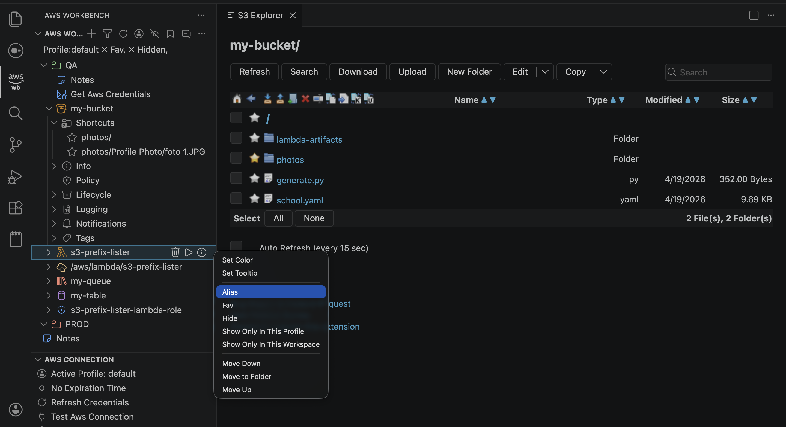

# AWS Workbench

A powerful VS Code extension that brings your AWS resources directly into your editor's sidebar. Explore, manage, and interact with S3, Lambda, Step Functions, DynamoDB, Glue, SQS, SNS, IAM, CloudWatch Logs, and more—all from one unified tree view.

## Features

### 🌳 Unified Resource Tree View
- Single tree view displaying all your AWS resources across services
- Organize resources by AWS profiles, regions, and services
- Persistent tree state that remembers your configuration between sessions

### 🪣 S3 Management
- Browse S3 buckets and objects
- Create, delete, and download files and folders
- Search and filter objects within buckets
- Direct file viewing and editing in VS Code

### ⚡ Lambda Functions
- List and manage Lambda functions
- View function configuration (environment variables, triggers, tags)
- Invoke functions with custom payloads
- Stream and view function logs in real-time
- Download and update function code

### 🔄 Step Functions
- Browse and manage state machines
- View state machine definitions (JSON/YAML)
- Start executions with validation
- Monitor execution status (running, succeeded, failed, etc.)
- View execution history and logs
- Compare and update definitions

### 🗄️ DynamoDB
- Browse tables and indexes
- View table keys, capacity, and configuration
- Query and scan tables with filters
- Add, edit, and delete items
- Batch operations support
- View and manage tags

### 🔧 AWS Glue
- Manage Glue ETL jobs
- View and download job code
- Compare and update job scripts
- Trigger jobs with custom parameters
- Monitor job runs and status
- View job run logs and history
- Generate job run reports

### 📬 SQS (Simple Queue Service)
- Browse and manage queues
- Send messages (ad-hoc or from file)
- Receive and view messages
- View queue details and policies
- Dead-letter queue support
- Purge queues

### 📢 SNS (Simple Notification Service)
- Manage topics and subscriptions
- Publish messages (ad-hoc or from file)
- View subscription details
- Create and delete subscriptions

### 🔐 IAM (Identity and Access Management)
- Browse IAM roles and policies
- View role trust relationships
- Inspect policy documents and versions
- View policy attachments
- Manage role inline policies
- View and manage tags

### 📊 CloudWatch Logs
- Explore log groups and streams
- View log events in real-time
- Filter and search logs
- Save frequently accessed log groups

### 📁 Local File Management
- Organize local files and scripts
- Create and manage bash scripts
- Quick access to project notes

## Installation

1. Open VS Code
2. Go to Extensions (Ctrl+Shift+X / Cmd+Shift+X)
3. Search for "AWS Workbench"
4. Click Install

## Getting Started

### Prerequisites
- AWS credentials configured locally (via `~/.aws/credentials` or `~/.aws/config`)
- An AWS account with appropriate permissions for the services you want to use

### Configuration

1. **Set AWS Profile**: Click the profile button in the Activity Bar to select your AWS profile
2. **Set Region**: Choose your preferred AWS region
3. **Add Resources**: Use the "+" buttons in the tree view to:
   - Add S3 buckets
   - Add Lambda functions
   - Add Step Functions state machines
   - Add DynamoDB tables
   - Add Glue jobs
   - Add SQS queues
   - Add SNS topics
   - Add IAM roles and policies
   - Add CloudWatch Log Groups

### Authentication
The extension uses AWS SDK's credential chain, which automatically detects credentials from:
- Environment variables (`AWS_ACCESS_KEY_ID`, `AWS_SECRET_ACCESS_KEY`)
- AWS credentials file (`~/.aws/credentials`)
- AWS config file (`~/.aws/config`)
- IAM role (when running in AWS)

## Usage

### Context Menus
Right-click on any resource for options like:
- **Add to Favorites**: Mark frequently used resources
- **Hide**: Temporarily hide resources from view
- **Copy Name/ARN**: Quick copying of resource identifiers
- **Open**: View resource details

### Filtering
- **Text Search**: Filter resources by name
- **Favorites**: Show only favorited resources
- **Hidden**: Toggle visibility of hidden resources
- **Profile/Region**: Filter by AWS profile or region

### Resource-Specific Actions

#### S3
- **Download**: Get files/folders to your local machine
- **Upload**: Push files to buckets
- **Delete**: Remove objects safely
- **Search**: Find objects by name or pattern

#### Lambda
- **Run**: Invoke functions with optional JSON payload
- **View Logs**: Stream real-time CloudWatch Logs
- **Edit Config**: Modify environment variables and settings
- **Download Code**: Export function code

#### Step Functions
- **Execute**: Start state machine executions
- **View Definition**: Inspect state machine JSON
- **Update Definition**: Modify and deploy new versions
- **Monitor**: Track execution status and history
- **View Logs**: Access execution logs

#### DynamoDB
- **Query**: Query tables with key conditions and filters
- **Scan**: Full table scans with filters
- **Add Item**: Create new items in tables
- **Edit Item**: Modify existing items
- **Delete Item**: Remove items from tables
- **Batch Operations**: Bulk import/export data
- **View Indexes**: Inspect global and local secondary indexes

#### Glue
- **Run Job**: Execute ETL jobs with parameters
- **View Code**: Inspect job scripts
- **Download Code**: Export job code locally
- **Compare Code**: Diff local vs deployed code
- **Update Code**: Deploy code changes
- **View Runs**: Monitor job run history
- **Run Reports**: Generate execution reports
- **View Logs**: Access job run logs

#### SQS
- **Send Message**: Send messages to queues
- **Receive Messages**: Poll and view messages
- **View Details**: Inspect queue configuration
- **View Policy**: Check queue access policy
- **DLQ Support**: Navigate to dead-letter queues

#### SNS
- **Publish**: Send messages to topics
- **View Subscriptions**: List topic subscribers
- **Manage Subscriptions**: Add/remove subscriptions

#### IAM
- **View Roles**: Browse IAM roles
- **View Policies**: Inspect policy documents
- **Trust Relationships**: View role trust policies
- **Policy Versions**: Compare policy versions
- **Attachments**: See policy attachments

#### CloudWatch Logs
- **View Events**: Stream log entries
- **Search**: Filter by keywords
- **Export**: Save logs to files

## Advanced Features

### Tree State Persistence
- Your tree configuration (expanded nodes, selections) is automatically saved
- Restore your view exactly as you left it

### Keyboard Shortcuts
- `Ctrl+Shift+X` / `Cmd+Shift+X`: Open Extensions
- Right-click for context menus
- Enter/Return: Expand/collapse nodes

### Export/Import
- Export your entire resource tree as JSON
- Import configurations to quickly restore or share setups

### Telemetry
Anonymous usage telemetry helps improve the extension (can be disabled in VS Code settings)

## Contributing
### Comming Soon
- File linking
- move aws services accross folders
- Telemetry logging
- Multi-line notes
- Bucket with a default key prefix
- add order the resources are shown in the tree view
- set a tooltip for resources in the tree view
- add notes to resources
- colorful resource icons

## Support

- Report issues on [GitHub](https://github.com/necatiarslan/aws-workbench/issues)
- Check [CHANGELOG.md](CHANGELOG.md) for version history
- Review the [AWS SDK documentation](https://docs.aws.amazon.com/sdk-for-javascript/) for AWS-specific questions

## Changelog

See [CHANGELOG.md](CHANGELOG.md) for a detailed history of changes and releases.